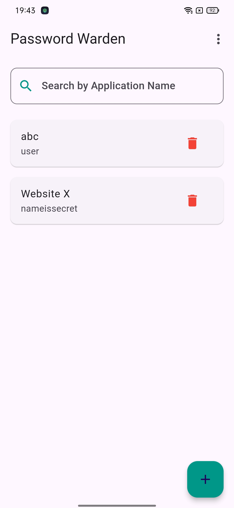
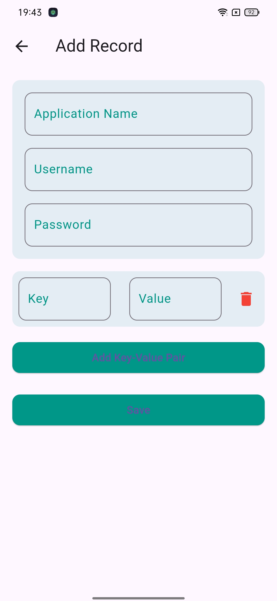
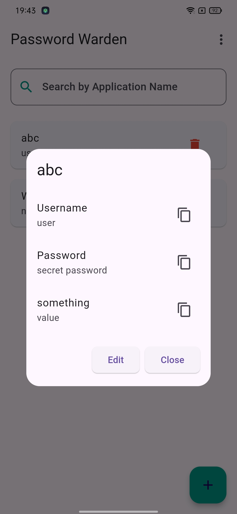
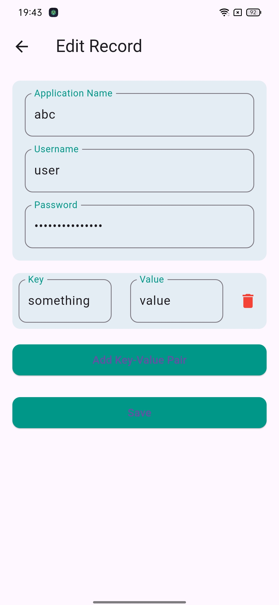
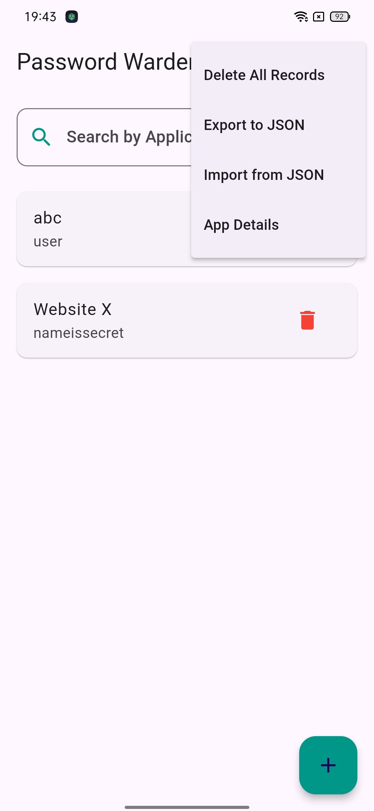
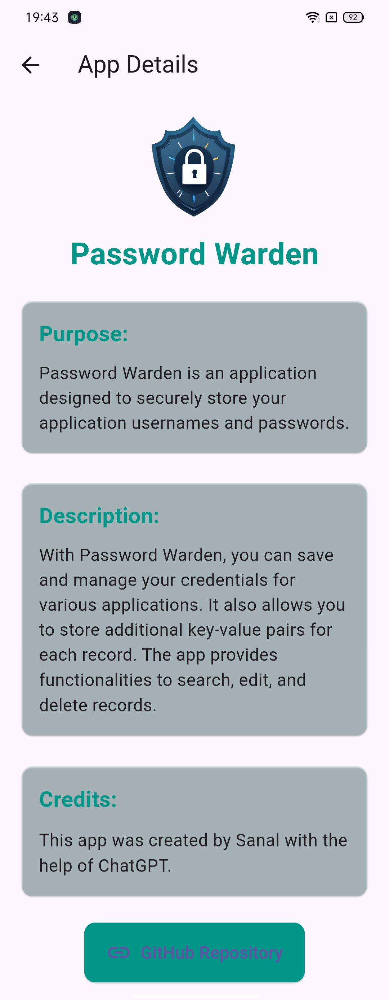
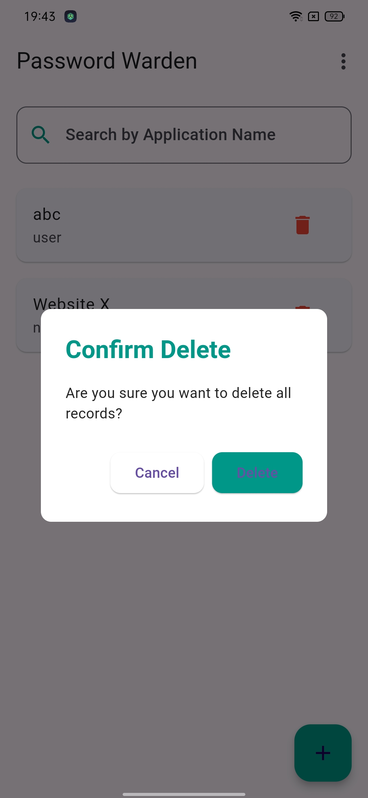

# 🛡️ Password Warden

**PassWarden**  
*Your Personal Credential Manager*


## 📱 About Password Warden

**Password Warden** is a simple yet powerful app designed to help you save, manage, and protect your credentials for various applications. With **PassWarden**, you can easily store key-value pairs for each record, providing you with the flexibility to save additional information beyond just usernames and passwords.

### 🗂️ Features

- **Save & Manage Credentials**: Store your usernames, passwords, and other key-value pairs securely.
- **Search Functionality**: Quickly find records using the search feature.
- **Edit & Delete Records**: Easily update or remove records as needed.
- **Export & Import Data**: 
  - Export your records into a JSON file for backup purposes. Please note that all sensitive data will be visible in the exported file.
  - Import data from a JSON file to restore the app’s state if the app crashes or records are accidentally deleted.
- **Phone Lock Integration**: Secure access to the app by requiring phone authentication before opening. This ensures that only authorized users can access your credentials.


### 🚀 Getting Started

1. **Clone the repository**: 
   ```bash
   git clone https://github.com/SanuSanal/Password-Warden.git
   ```
2. **Navigate to the project directory**: 
   ```bash
   cd password-warden
   ```
3. **Install dependencies**: 
   ```bash
   flutter pub get
   ```
4. **Run the app**: 
   ```bash
   flutter run
   ```

### 📸 Screenshots

Check out the screenshots to see Password Warden in action!

<div style="display: flex; gap: 10px;">
   
   
   
   
   
   
   
</div>

### 📦 Download & Installation

The latest version of Password Warden is available for download from the [Releases](https://github.com/SanuSanal/Password-Warden/releases) section on GitHub. Simply download the APK file and install it on your device.

### 🤝 Contributions

We welcome contributions! If you have any ideas, suggestions, or find any bugs, feel free to open an issue or submit a pull request.

### 🔧 Built With

- **Flutter** - The framework used for building the app.
- **GitHub Actions** - Continuous integration and deployment.

### 🙌 Acknowledgements

This app was developed with the help of **ChatGPT**. Special thanks to everyone who contributed to making this project a success!

### 📄 License

This project is licensed under the MIT License. See the [LICENSE](LICENSE) file for more details.

---

**Happy Password Managing!**  
Made with ❤️ by [Sanal](https://github.com/SanuSanal)
